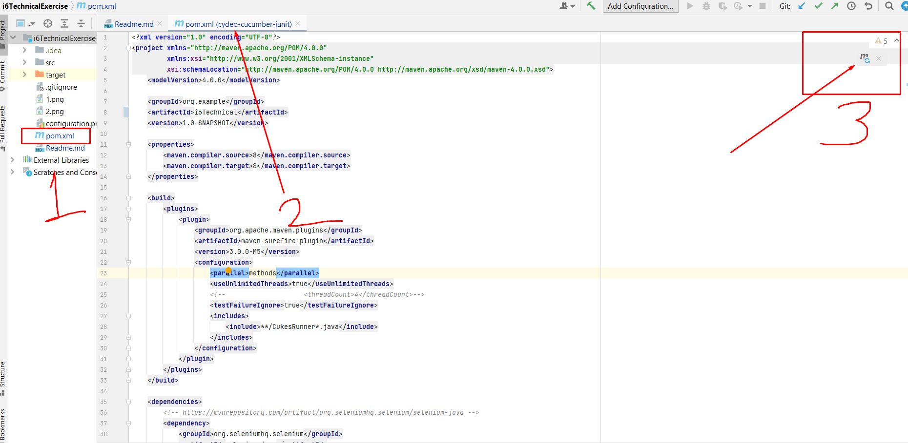
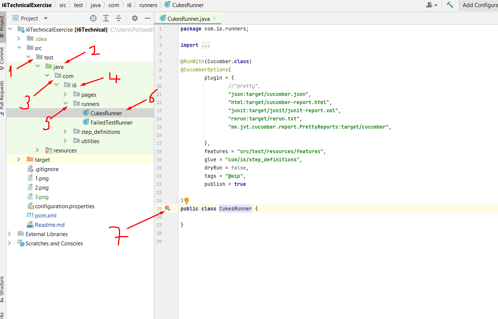
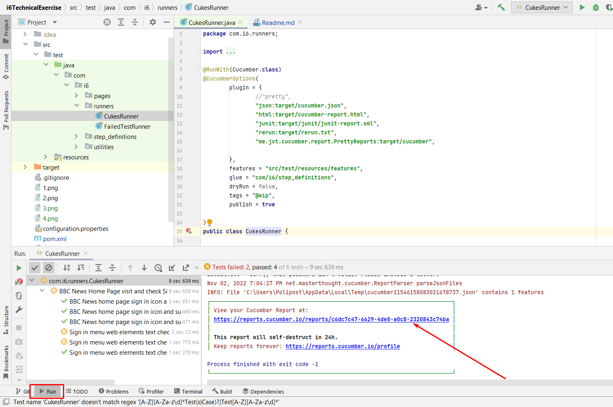

Step by step Run our Test

Open your IntelliJ IDEA and click New than Project from Version Control

Than please copy https://github.com/ozerknet/i6TechnicalExercise.git this link and 
1- Paste it inside URL 
2- Choose your Directory for project cloned
3- Click Clone 

Than please click pom.xml
be sure your pom.xml is opened
than click m icon for load Dependencies 

Than click every steps folder for access CukesRunner and 
click RUN button show on the step 7

After Test runs, be sure you on the Run tab, 
you will see a report link, you can click and see report of the test

